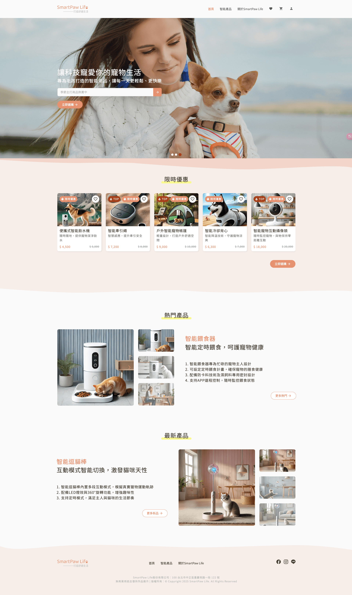
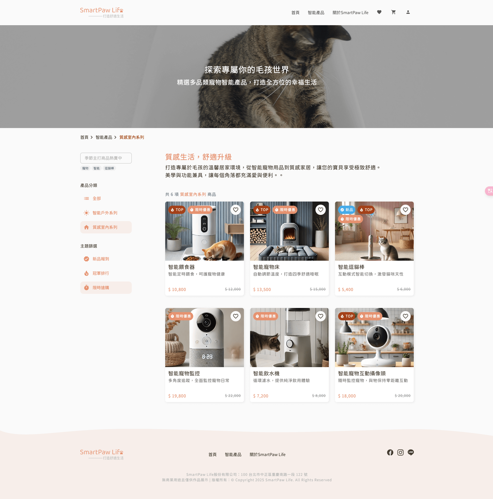
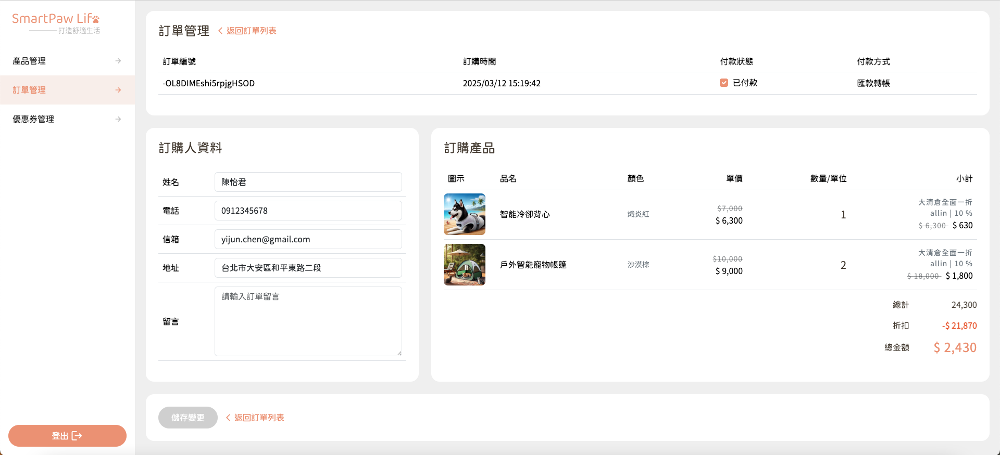

# 🐾 SmartPawLife｜寵物智慧電商平台

> 📘 This README is in Chinese. [Click here for English version.](./README_EN.md)

SmartPawLife 是一個專為寵物打造的智慧電商平台，包含前台購物流程與後台管理系統。
支援商品瀏覽、購物車、結帳流程與後台商品管理、訂單管理、優惠券管理功能，並於前台和後台登入頁實作響應式設計。

👉 [🔗 前台線上Demo](https://satarkuo.github.io/SmartPawLife/)

👉 [🔗 後台線上Demo](https://satarkuo.github.io/SmartPawLife/#/login) (後台建議使用裝置解析度寬1440px以上)

---

## 🔐 測試帳號

後台登入可使用以下帳號：

```txt
帳號：satarkuo@gmail.com
密碼：123456
```

---

## ✨ 功能介紹

### 🔸 前台功能

- 首頁
- 商品列表、商品詳細頁
- 商品分類篩選 (Redux/ RTK:Redux Toolkit)
  - 主分類：全部、智能戶外系列、質感室內系列
  - 主題篩選：新品報到(最新上架)、冠軍排行(熱門商品)、限時搶購(折扣商品)
- 商品關鍵字搜尋 (含快速帶入關鍵字功能)
- 加入購物車、修改數量、刪除商品
- 購物車填寫表單結帳流程 (react-hook-form)
- 品牌介紹頁
- 加入、取消收藏商品(使用localStorage)
- 使用者登入(使用cookie儲存token)
- 響應式設計（RWD）

### 🔸 後台功能（Admin）

- 管理者登入
- 商品管理：新增、編輯、刪除、查看單一商品
- 訂單管理：查看單一訂單、編輯、刪除
- 優惠券管理：新增、編輯、刪除、查看單一優惠券

---

## 🛠 技術架構與使用套件

- **框架**：React + Vite
- **樣式**：Bootstrap5、Material Icons、SCSS、Sass 7-1 Pattern
- **套件**：SweetAlert2、react-loading
- **路由管理**：React Router
- **狀態管理**：useState + useEffect + Redux Toolkit
- **表單管理**：react-hook-form
- **API 串接**：Axios（串接課程提供 API）
- **畫面邏輯**：前後台功能與頁面功能皆由本人自行實作（含資料渲染、錯誤處理等）
- **Dependencies**：

```txt
@reduxjs/toolkit: ^2.6.0,
axios: ^1.7.9,
bootstrap: ^5.3.3,
material-icons: ^1.13.14,
react: ^18.3.1,
react-dom: ^18.3.1,
react-hook-form: ^7.54.2,
react-loading: ^2.0.3,
react-redux: ^9.2.0,
react-router-dom: ^6.29.0,
sweetalert2: ^11.17.2,
swiper: ^11.2.5
```

- **DevDependencies**：

```txt
@eslint/js: ^9.19.0,
@types/react: ^19.0.8,
@types/react-dom: ^19.0.3,
@vitejs/plugin-react: ^4.3.4,
eslint: ^9.19.0,
eslint-plugin-react: ^7.37.4,
eslint-plugin-react-hooks: ^5.0.0,
eslint-plugin-react-refresh: ^0.4.18,
globals: ^15.14.0,
sass: ^1.62.1,
vite: ^6.1.0
```

---

## 📁 專案資料夾結構簡介

- 本專案採用模組化設計，資料夾說明如下：

```txt
src/
├─ assets/      # 靜態資源（圖檔、樣式等）
├─ component/   # 可重複使用的元件
├─ data/        # 靜態資料
├─ hooks/       # 自定義 React Hooks
├─ layout/      # 主要頁面架構（Header、Footer 等）
├─ redux/       # Redux Toolkit 狀態管理設定
├─ routes/      # React Router 路由設定
├─ utils/       # 工具函式（轉換時間格式等）
└─ views/       # 頁面元件（所有前後台頁面）
```

---

## 🚀 快速啟動

```bash
# 安裝套件
npm install

# 啟動專案
npm run dev
```

🔸 備註：此專案為前端練習作品，API 為課程提供，無需額外啟動後端伺服器。

---

## ✨ 開發規劃與擴充方向

- 搭配 json-server 與 \_expand 關聯參數，實作會員、專欄文章、商品評價的關聯資料展示
- 實作寵物專欄（部落格）列表與內文頁面
- 搭配 json-server 實作專欄文章、會員身份、評價系統的 \_expand資料關聯

---

## 📷 畫面預覽

以下為 SmartPawLife 專案部分畫面截圖，完整體驗請參考 Demo 網站。

### 首頁畫面



### 產品列表畫面



### 後台訂單管理畫面

備註：訂單資料與聯絡資訊皆為模擬資料



---

## 🙋‍♀️ 開發與參與人員

- 前端：Satar Kuo

- 後台設計：Satar Kuo

- 前台設計：Ｍillie Qiu 設計師

- 使用六角React專題課程API進行開發，如有建議或想法歡迎 Issue 或聯絡我！

## 📚 指導導師（六角學院）

- React技術導師：卡斯伯老師

- JS技術導師：洧杰校長、穎旻老師

- 專題教練：Yennefer教練

- 課程助教：Jay助教、傑利助教

## 🛠️ 專案修改需求紀錄

- 專題批改助教：傑利助教

- 專題批改設計師：Jamie 設計師

- 根據助教與設計師指導建議進行修改，並以文件記錄處理方式

- [🔗 20250331-修改需求](https://wax-gladiolus-68e.notion.site/20250331-1c71186c0f56801982dde281079f4424?pvs=4)

- [🔗 20250408-修改需求](https://wax-gladiolus-68e.notion.site/20250408-1d01186c0f568027a76de0eb7d64cf55?pvs=4)

---

## 🏅 技術證書

### ✨ React 完課證書（六角學院）

- 所有作業皆以最高等級LV3完成
- 已完成課程，預計於2025/5/12發放完課證書

### ✨ React 上機考A級証書（六角學院）

- 試題包含觀念選擇題、上機考實作題型


### ✨ JS 完課證書（六角學院）

- 所有作業皆以最高等級LV3完成


